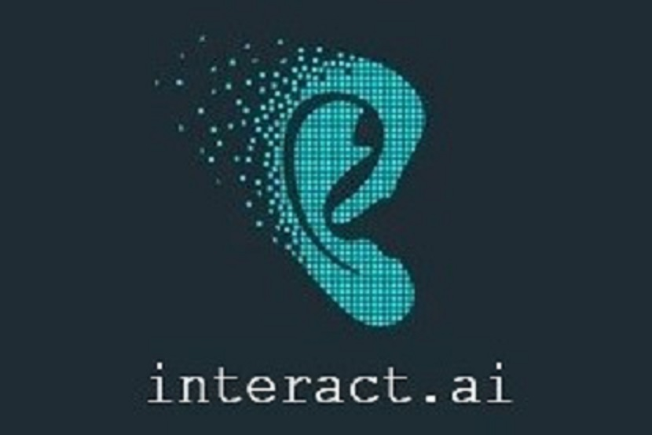

# interact.ai

 
"Society has the tendency to focus on disability rather than ability" said **Rachel Kolb** in her [Ted talk](https://www.youtube.com/watch?v=uKKpjvPd6Xo&t=220s)   and we are here to fix that. Ever wondered how difficult, tiring and time consuming it is for a Sign language interpreter? We provide a solution that automates this task.

## Why Cued Speech?

Compared to ASL, which is a language by itself, **cued speech** is a _visual system of communication_ used among deaf or hard-of-hearing people. Cued Speech has different representations in the form of _hand shapes_ for syllables in the Natural language and takes only about 20 hours to learn. Study shows that one can achieve an interpreting accuracy of ~30% with lip reading but combined with cued speech this can be increased to a mind blowing 96%. 

## How it works?

We first put considerable effort into learning Cued Speech. We then wrote a python library for interpretation of Cued Speech using the CMU Dictionary for English pronunciations. Given an input sentence the library will break the words into its syllables and return the corresponding Cued Speech position from the available 64 positions.

Our app records incoming voice, converts it into text and sends it to the python script running on a flask server on Google Cloud. The text is given to the library that processes it to give the corresponding cued speech position. We then use State of the Art Deep learning framework to fetch a "fake" face from [thispersondoesnotexist.com](https://thispersondoesnotexist.com) and apply lip sync to it. 

The lip synced video and  corresponding cued speech positions then go into a simple script that animates the hand positions into the video. 
The video is then sent back and played in our app.

Although the library was doing a pretty good job, when given a word outside of the CMU Dictionary of pronunciation it would throw a KeyError. To fix this we trained a Transformer model on all the existing pronunciations from the CMU Dictionary to achieve State of the Art model for text to phoneme. Given a word outside of the dictionary the script would ask the model to predict the pronunciation of the new word instead.

## Workflow

1. Input speech is interpreted as text and sent to python script running on GCP.
2. A python library takes this text and gives the corresponding Cued Speech position(Using CMU Dictionary).
3. If the word from the sentence is not in the dictionary, a model trained on the dictionary is asked to predict the pronunciation for this new word.
3. Text in the form of audio (using gTTS python library) along with a face of a human that does not exist is sent to a deep learning model([Wav2Lip](https://github.com/Rudrabha/Wav2Lip)) that animates the lip sync.
4. Video and the corresponding positions are sent to a script that animates the hand positions into the video.
5. The app plays the video.
